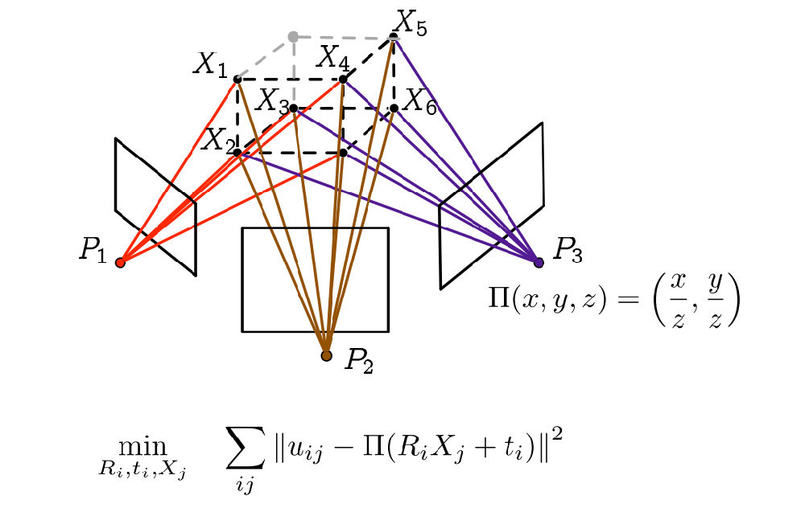

> “Yeah It's on. ”

---
typora-copy-images-to: Images
---
### classic state trasition and observe model

$$
\begin{cases}
    x_k=f(x_{k-1},u_k,w_k)\\
    z_{k,j}=h(y_j,x_k,v_k,j)
  \end{cases}
$$


### Pin hole camera model

$$
X'=X \frac{f}{Z} \\ Y'=X \frac{f}{Z}
$$

### convert to the pixel plate

$$
u_x=\alpha X'+c_x\\ u_y=\beta Y' +c_y
$$

$\alpha 、\beta$ the scale factor from length unit: m to pixel size. $c_x、c_y$the offset of the optical centre;

 


combile (1) & (2):
$$
\begin {pmatrix}   u \\ v\\ 1\end{pmatrix}=\frac{1}{Z} \begin{pmatrix} fx &0&c_x \\ 0& f_y& c_y \\ 0 & 0 &1 \end{pmatrix}  \begin{pmatrix}  X\\ Y\\Z \end{pmatrix} = \frac{1}{Z}KP
$$


$$
ZP_{uv}=Z\begin{bmatrix} u \\ v \\1\end{bmatrix}=K(RP_w+t)=KTP_w
$$
There is a convertion from 普通坐标到齐次坐标；


### 重投影误差



其中$i$是图像帧数目，$j$是观测到的所有的特征点的数量；

The methods for solve non-linear-

| 最速下降法 | 线搜索  |      |
| ----- | ---- | ---- |
|       |      |      |
|       |      |      |
|       |      |      |
|       |      |      |
|       |      |      |

#### Camera Model

We use a pinhole camera model; the parameters we estimate for each camera area rotation 

R

, a translation 

t

, a focal length 

f

 and two radial distortion parameters 

k1

 and 

k2

. The formula for projecting a 3D point 

X

 into a camera 

R,t,f,k1,k2

 is:

```
P  =  R * X + t       (conversion from world to camera coordinates)
p  = -P / P.z         (perspective division)
p' =  f * r(p) * p    (conversion to pixel coordinates)

```

where 

P.z

 is the third (

z

) coordinate of 

P

. In the last equation, 

r(p)

 is a function that computes a scaling factor to undo the radial distortion:

```
r(p) = 1.0 + k1 * ||p||^2 + k2 * ||p||^4.

```

This gives a projection in pixels, where the origin of the image is the center of the image, the positive x-axis points right, and the positive y-axis points up (in addition, in the camera coordinate system, the positive z-axis points backwards, so the camera is looking down the negative z-axis, as in OpenGL).