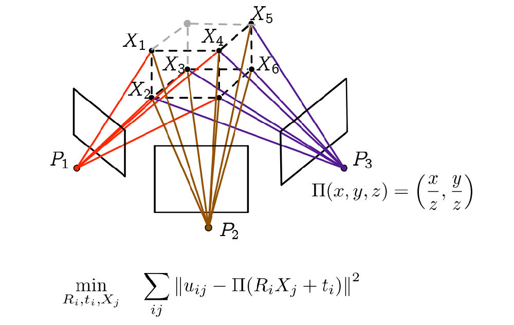

> “Yeah It's on. ”

# chan 7 视觉里程计

only record what you needs to know……

---

- 概念

  - Image Feature ：Key-**points** and **Descriptor**

  - SIFT（Scale-Invariant Feature Transform）

  - ORB （**Oriented** **FAST** 【key-points】and Rotated **BRIEF** 【descriptor】） 

  - FAST only check the area where the brightness change obviouly。

    FAST-11 与 FAST-9  related to the  [Non-maximal suppression](http://www.cnblogs.com/makefile/p/nms.html)

  - ORB add Scale and Rotate descriptor to FAST key-points by Intensity Centroid(灰度质心法)

    ​


$$
m_{pq}=\sum _{x,y \in B} x^p y^q I(x,y) \space  p,q=\{0,1\}
$$

​		mass center of image B
$$
C=(\frac{m_{10}}{m_{00}},\frac{m_{01}}{m_{00}})
$$
​		Orientation 
$$
\theta = arctan(m_{01}/m_(10))
$$
	- BRIEF a kind of descriptor consists with 0 and 1 represent for the relationship beweent two  neighbour points.


- Brute-Force Matcher Just find the nearest by compare then sort with each key-points

  ```
  //Code todo
  ```

- Using hamming distance to judge whether two points a close

- But in SLAM FLANN is applied 


## 2D-2D : 对极几何



- 极平面（Epipolar plane）$PO_1O_2$
- 极点（Eipoles）$e_1,e_2$
- 基线（Baseline）$O_1O_2$
- 极线（Epipolar line）$l_1,l_2$


$$
P=[X,Y,Z]
$$

$$
s_1p_1=KP, \\s_2p_2=K(RP+t)
$$

K 相机内参，R，t 相机的相对运动。

取 
$$
x_1=K^{-1}p_1 \space  , x_2=K^{-1}p_2
$$
带入上↑式：
$$
x_2=Rx_1+t
$$
↑式两边同乘$t^{\hat{}}$(相当于X乘)
$$
t^{\hat{}}x_2=t^{\hat{}}Rx_1
$$
↑式两边左乘$x_2^T$
$$
x_2^Tt^{\hat{}}x_2=x_2^Tt^{\hat{}}Rx_1
$$
↑式左侧有$t^{\hat{}}x_2$与$t$和$x_2$都垂直。↑式两边同时左乘$x_2$
$$
x_2^Tt^{\hat{}}Rx_1=0
$$
重新带入$p_1,p_2$有：
$$
p_2^TK^{-T}t^{\hat{}}RK^{-1}p_1=0
$$
以上两式都是对极约束。

- $F$ (Fundamental Matrix)  $F=K^{-T}t^{\hat{}}RK^{-1}$

- $E$  ( Essential Matrix)  $E=t^{\hat{}}R$
  $$
  x_2^TEx_1=p_2^TFp_1=0
  $$
  ​

## 本质矩阵

$$
E=\pmatrix{e_1&e_2&e_3\\e_4&e_5&e_6\\e_7&e_8&e_9}
$$

为便于进行类似最小二乘的计算，化简对极约束至如下形式：
$$
[u _1u_2,u_1v_2,u_1,v_1u_2,v_1v_2,v_1,u_2,v_2,1]*e=0
$$
对极约束是0方程，所以$E$的自由度为8,采用8对点即可确定$E$
$$
\pmatrix{u _1^1u_2^1&u_1^1v_2^1&u_1^1&v_1^1u_2^1&v_1^1v_2^1&v_1^1&u_2^1&v_2^1&1\\
u _1^2u_2^2&u_1^2v_2^2&u_1^2&v_1^2u_2^2&v_1^2v_2^2&v_1^2&u_2^2&v_2^2&1\\
\vdots & \vdots & \vdots & \vdots & \vdots & \vdots & \vdots & \vdots & \vdots\\
u _1^8u_2^8&u_1^8v_2^8&u_1^8&v_1^8u_2^8&v_1^8v_2^8&v_1^8&u_2^8&v_2^8&1
}\pmatrix{e_1\\e_2\\e_3\\e_4\\e_5\\e_6\\e_7\\e_8\\e_9}=0
$$


求解$E$ 采用SVD

$$
E=U\sum V^T
$$
其中$U ,V$是正交矩阵，$\sum$为奇异值矩阵。根据$E$的内在性质……


